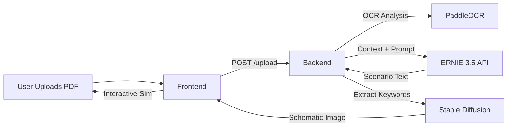

# 🧠 SkillSync: AI Simulation Engine

> **Turn static PDF manuals into immersive, visual, and multilingual safety simulations.**

SkillSync is an AI-powered educational platform that ingests technical documentation (PDFs) and instantly generates interactive roleplay scenarios. It bridges the gap between theory and practice by creating **context-aware visual aids** and **multilingual simulations** on the fly.

---

## 🚀 Live Demo

### [👉 Try the Live App Here](https://skillsync-drab.vercel.app)

*(No setup required. Upload a manual and start training.)*

---

## ✨ Key Features

* **📄 Intelligent Document Ingestion**
Uses **PaddleOCR** and `pdfplumber` to extract text from complex, scanned, or double-column industrial manuals where standard parsers fail.
* **🧠 ERNIE 3.5 Powered Simulation**
Leverages Baidu's **ERNIE-3.5** (via AI Studio) to generate logically sound, context-aware scenarios and Multiple Choice Questions (MCQs).
* **🎨 Dynamic Visual Generation**
Automatically detects physical concepts in the text (e.g., "Broken Valve") and generates technical **blueprint-style schematics** using **Stable Diffusion XL** (via Hugging Face), with a fallback to Pollinations.ai.
* **🌍 The Babel Fish (Multilingual)**
Upload an English manual and run simulations in **Chinese, Spanish, or Bemba** with zero latency using ERNIE's cross-lingual capabilities.
* **🛡️ Robust Error Handling**
Features a deterministic "Safety Net" that ensures the simulation never crashes, even if the AI hallucinates or hits API rate limits.

---

## 🏗️ Architecture

We pivoted from a heavy, local-GPU architecture to a **Cloud-Native, API-First approach** for maximum stability and speed.

| Component | Technology | Role |
| --- | --- | --- |
| **Frontend** | **React + Tailwind** | hosted on **Vercel**. Provides the Cyberpunk UI and state management. |
| **Backend** | **FastAPI (Python)** | hosted on **Render (Docker)**. Orchestrates the AI logic. |
| **OCR Engine** | **PaddleOCR** | Runs inside the Docker container to digitize scanned PDFs. |
| **Text AI** | **ERNIE-3.5** | Called via `erniebot` SDK for logic and storytelling. |
| **Visual AI** | **SDXL 1.0** | Called via `huggingface_hub` for generating technical diagrams. |

### System Flow



---

## 🛠️ Local Development

### Prerequisites

* Node.js 18+
* Python 3.10+
* Docker (Optional, for testing container builds)

### 1. Backend Setup (FastAPI)

```bash
# Clone the repo
git clone https://github.com/happi-web/SkillSync.git
cd SkillSync/backend

# Create virtual environment
python -m venv venv
source venv/bin/activate  # Windows: venv\Scripts\activate

# Install dependencies
pip install -r requirements.txt

# Set Environment Variables (Create a .env file)
# export AI_STUDIO_TOKEN="your_baidu_token"
# export HF_TOKEN="your_huggingface_token"

# Run Server
uvicorn main:app --reload

```

### 2. Frontend Setup (React)

```bash
cd ../frontend

# Install dependencies
npm install

# Run locally
npm start

```

---

## 📦 Deployment Guide

### Backend (Render.com)

The backend requires system-level C++ libraries for PaddleOCR, so we deploy using **Docker**.

1. Push your code to GitHub.
2. Create a **New Web Service** on Render.
3. Select **Runtime: Docker**.
4. Add Environment Variables: `AI_STUDIO_TOKEN` and `HF_TOKEN`.
5. Deploy.

*(Note: The repository includes a `Dockerfile` optimized for Render's free tier, pre-configured with `libGL` and other OCR dependencies.)*

### Frontend (Vercel)

1. Push code to GitHub.
2. Import project into Vercel.
3. Set the `REACT_APP_API_URL` environment variable to your **Render Backend URL**.
4. Deploy.

---

## 🐛 Troubleshooting

### ❌ "Server Error / 500" on Upload

* **Cause:** The OCR engine ran out of memory processing a large PDF.
* **Fix:** Try a smaller PDF or wait a moment. The Render Free Tier has 512MB RAM limits.

### ❌ Images look "Off Topic"

* **Cause:** The AI generated a generic image because the context wasn't clear.
* **Fix:** The backend now injects the "Manual Topic" into the image prompt automatically. Ensure your PDF filename is descriptive (e.g., `Centrifugal_Pump_Manual.pdf`).

---

### 👤 Author

**Created by Chilongo Kondwani**
*Developed for the ERNIE AI Developer Challenge.*